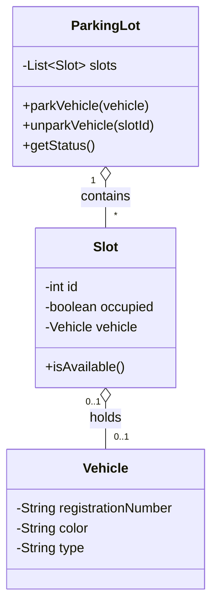

# Parking Lot Management System

**Repository:** `0shubham2802/parking-lot-management`

> A simple console-based Parking Lot Management System written in Java.

---

## Table of Contents

- [Overview](#overview)
- [Features](#features)
- [Project structure](#project-structure)
- [Requirements](#requirements)
- [How to run (IDE / Command line)](#how-to-run-ide--command-line)
- [Usage](#usage)
- [Class diagram](#class-diagram)
- [Extending & Notes](#extending--notes)
- [Contributing](#contributing)
- [License](#license)

---

## Overview

This is a Java-based console application that simulates a parking lot management system. It models parking slots, vehicles, and the operations typically required to park, unpark, and query vehicles.


## Features

- Add (park) vehicles into available slots
- Remove (unpark) vehicles and free up slots
- Query the parking lot for occupancy/status
- Simple, easy-to-follow code suitable for learning/extension


## Project structure

```
parking-lot-management/
├─ .idea/
├─ src/
│  └─ org/
│     └─ ParkingLot/
│        ├─ (Java source files)
├─ .gitignore
├─ Parking_Lot_Management_System.iml
```

The code is organized under the `org.ParkingLot` package. The main classes implement core parking lot entities and operations.


## Requirements

- Java JDK 8 or higher
- An IDE (IntelliJ IDEA, Eclipse) or command-line tools (`javac`, `java`)


## How to run (IDE / Command line)

### Run in an IDE
1. Clone the repository:

```bash
git clone https://github.com/0shubham2802/parking-lot-management.git
cd parking-lot-management
```

2. Open the project in IntelliJ IDEA or Eclipse as an existing project (select the `src` folder as source root if needed).
3. Locate the class that contains the `public static void main(String[] args)` method (likely under `org.ParkingLot`) and run it.


### Run from command line

1. From the project root, compile sources (example assumes `src` contains package folders):

```bash
javac -d out $(find src -name "*.java")
```

2. Run the main class (replace `org.ParkingLot.MainClass` with the actual main class name):

```bash
java -cp out org.ParkingLot.MainClass
```


## Usage

When you run the program you should see console prompts to perform operations such as parking a vehicle, unparking, or viewing status. Typical commands include:

- `park` — park a vehicle (enter vehicle details when prompted)
- `unpark` — remove a vehicle (provide slot number or vehicle registration)
- `status` — show occupied/free slots and vehicle details
- `exit` — quit the application

> Exact commands and prompts depend on the implementation of `main` in the repository.


## Class diagram

Below is a high-level class diagram (Mermaid) representing the typical relationships in this project. I modeled this from the `org.ParkingLot` package structure and common parking lot designs.




## Extending & Notes

- Add persistence: integrate a small embedded DB (H2/SQLite) or write to CSV to persist state across runs.
- Add a GUI or a simple REST API using Spring Boot for remote access.
- Add unit tests (JUnit) for core operations.


## Contributing

Contributions are welcome. Create issues or pull requests for bug fixes and features.


---


